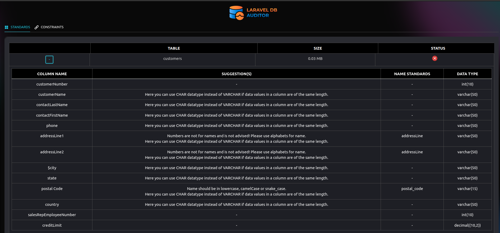

<p align="center"></p>


[](https://packagist.org/packages/vcian/laravel-db-auditor)

## Introduction

- This package provides to audit process of reviewing and evaluating a mysql and sqlite database system.
- DB Auditor scan your mysql/sqlite database and give insights of  standards, constraints and provide option to add the constraints through CLI.
- The result of audit process shows list of tables & columns which doesn't have proper standards.

## Installation & Usage

> **Requires [PHP 8.0+](https://php.net/releases/) | [Laravel 8.0+](https://laravel.com/docs/8.x)**

Require Laravel DB Auditor  using [Composer](https://getcomposer.org):

```bash
composer require --dev vcian/laravel-db-auditor
```
## Usage:

You can access DB Auditor using below artisan commands.

> #### **php artisan db:audit**
> 
> This command give you options to select feature like check the database standards or check the constraint.
> 
> Now, you can skip tables which you don't want to check. Add skip table name in the .db-auditor.php file.
>

**Note:**

If you want to check standalone feature then you can execute below artisan command one by one.

> #### **php artisan db:constraint**
> 
> This command gives you result with list of tables with primary,foreign,unique,index constraint.
> 
> 
> You can add more constraint to the table by seeing existing constraint with table.
> 
> Below example give insights about the how to see constraints in table and how to add.
> 
> Note :- SQLite does not allow to define PRIMARY KEY or FOREIGN KEY into a existing table. Therefore , you will not show any constraint edit option in this case.
>

<p align="center"></p>

<p align="center"></p>

<p align="center"></p>

<p align="center"></p>


---
> #### **php artisan db:standard**
> 
> This command give you result with list of table with standard follow indication.
> 
> 
> You can also see table specific column name which doesn't have standard followed.
>
> Below example give insights of database standards reports and suggestions.
>
>
<p align="center"></p>

<p align="center"></p>

<p align="center"></p>

---
> #### **php artisan db:track**
> 
> This command give you the track of the database files. Like when it's created with how many field in which table or whom created. this type of information show in the result.
> 
> 
> You can also filter with --table=, --action=, --status=.
> Note: "created by" return the github username and if it's not git repo than it shows system username.
>
</p>
</p>
</p>
</p>
**Note:**

You have to set your database name with _DB_DATABASE_ parameter in you laravel .env file to use this feature.

## ACCESS WEB PAGE

You can also access this feature through WEB UI. To access web UI, kindly execute below command.

php artisan vendor:publish --tag=public

select "db-auditor"

Route - To access the web UI  "/laravel-db-auditor"

<p align="center"></p>


<p align="center"></p>

<p align="center"></p>


## Changelog

Please see [CHANGELOG](CHANGELOG.md) for more information what has changed recently.

## Contributing

Please see [CONTRIBUTING](CONTRIBUTING.md) for details.

       We believe in 
            👇
          ACT NOW
      PERFECT IT LATER
    CORRECT IT ON THE WAY.

## Security

If you discover any security-related issues, please email ruchit.patel@viitor.cloud instead of using the issue tracker.

## Credits

- [All Contributors](../../contributors)

## License

The MIT License (MIT). Please see [License File](LICENSE.md) for more information.
